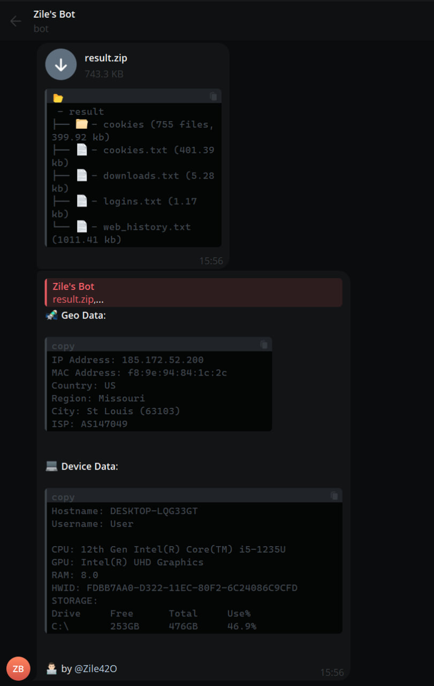

# main
python script that steals alot of pc info and then sends it to your telegram bot

## demo

## how to use
step 1 - download the python file, as well as text file, and place both in same folder. then open a cmd prompt in the folder location, and type `pip install -r requirements.txt`.

step 2 - go to telegram and creat a bot using [BotFather](https://t.me/BotFather). copy that api token given by bot and paste it into line 60 in the script, replacing the 
YOUR BOT TOKEN text.

step 3 - get your chat id by going to the [Show Chat ID](https://t.me/show_chat_idbot) bot and starting it. paste that id into line 61 of the code, replacing the YOUR CHAT ID line

step 4 - run the script, and watch the magig happen :)

## credits
addi00000
&
Zile420

original script was made by these two devs, im just making a updated tutorial on how to use.

## disclaimer
this program is only for educational purposes. the other developers and i are not responsible for any mis-use of this script.
